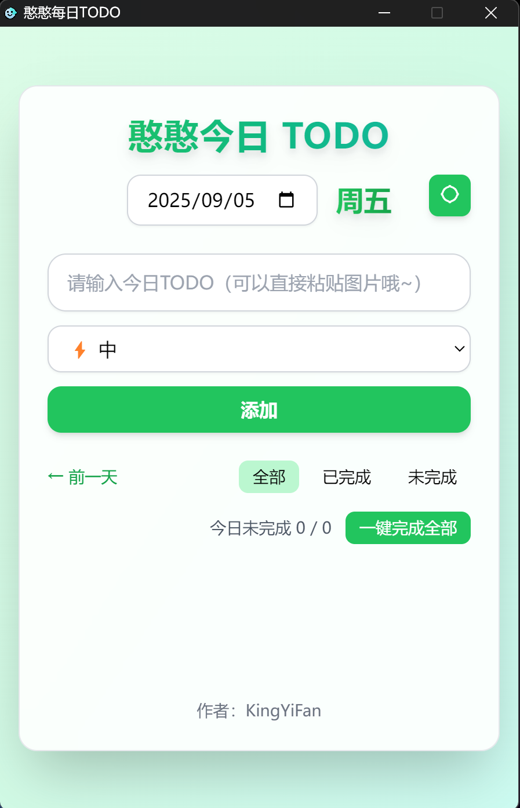
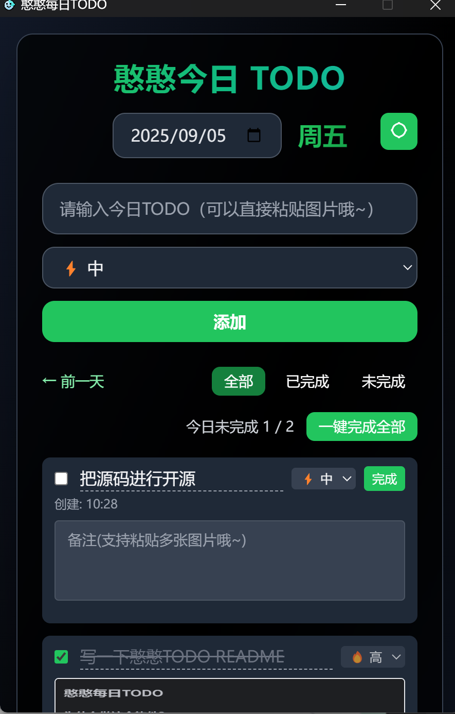
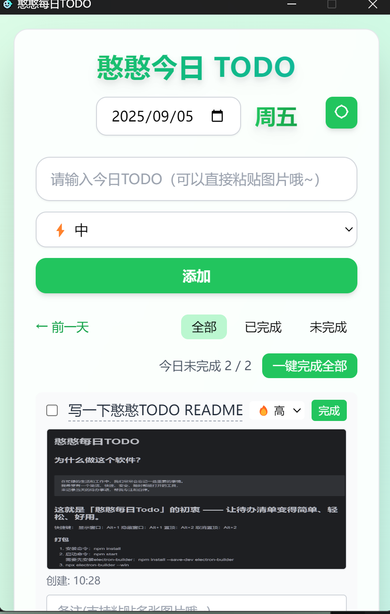
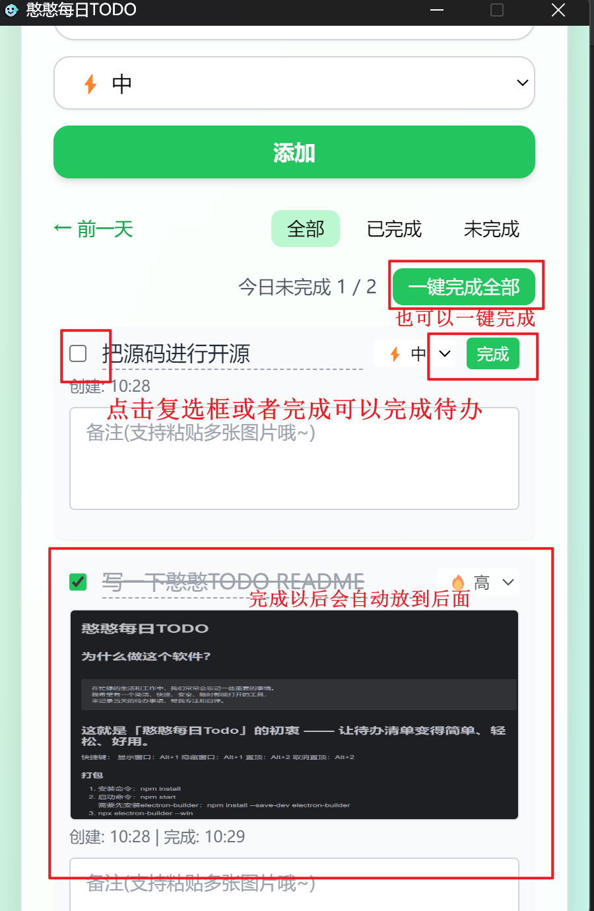
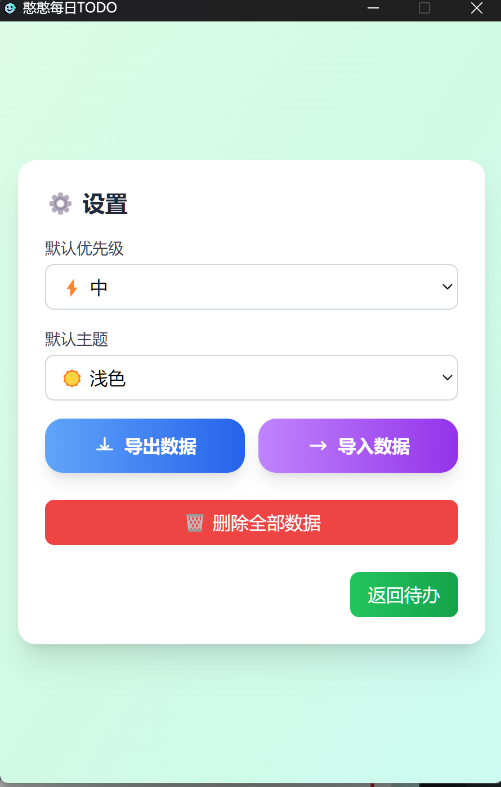
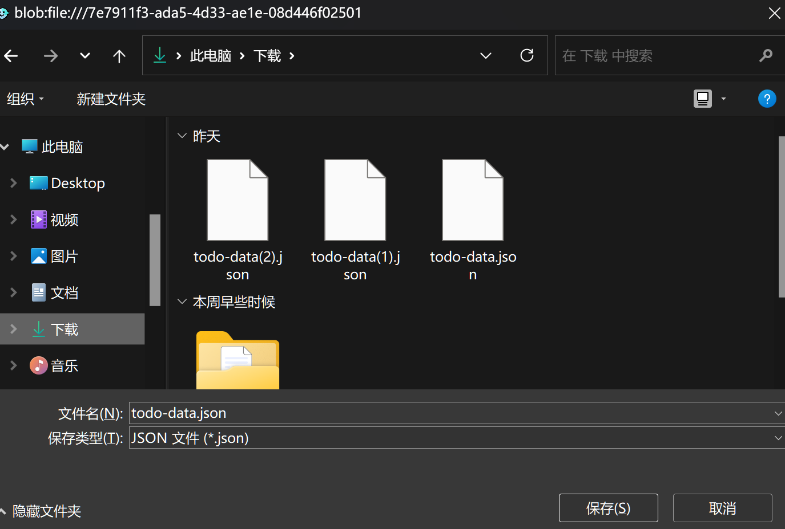
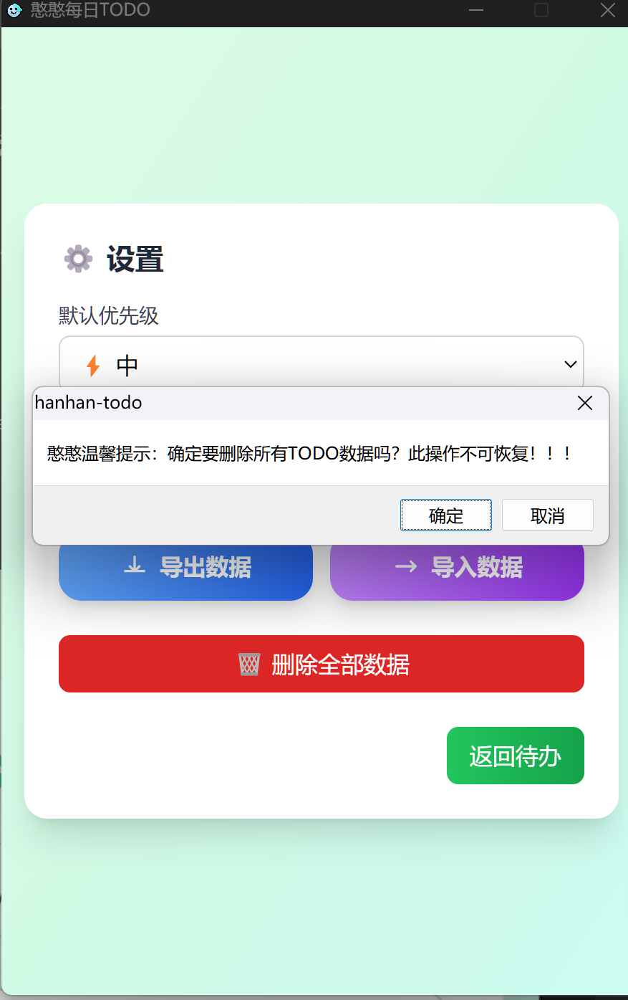
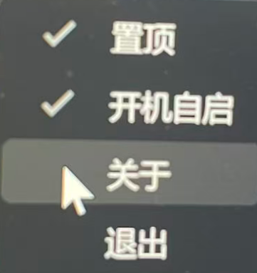
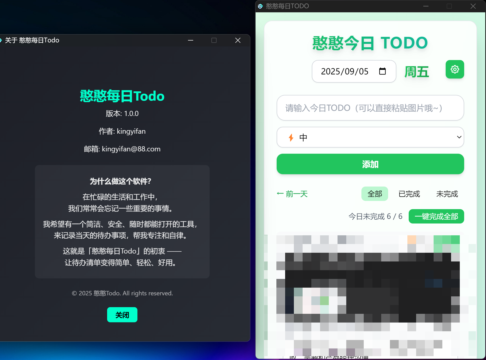

# 憨憨每日TODO (HanHan Todo)

一个简洁、快速、安全的桌面待办事项管理工具，帮助您专注和自律地完成每日任务。

## 🎯 项目初衷

在忙碌的生活和工作中，我们常常会忘记一些重要的事情。我希望有一个：

- 简洁直观的界面
- 快速响应的操作体验
- 本地存储，安全可靠
- 随时都能打开的工具
- 不打扰默默守护我的小工具

简洁、快速、安全、随时都能打开的TODO的工具来记录当天的待办事项，帮我专注和自律。

这就是「憨憨每日Todo」的初衷 —— 让TODO（待办清单）变得简单、轻松、安全、好用。

## 🌟 功能特性

- 📝 符合国人习惯的TODO(待办事项)管理
- 🌗 深色/浅色主题切换
- 📎 支持快速粘贴图片到任务中
- ⌨️ 快捷键支持，操作更高效
- 💾 数据导出/导入功能
- 🚀 开机自启和系统托盘支持
- 📤 窗口置顶功能
- 🧹 一键清空数据

## 🌐 网页在线访问

- 网页开源地址：https://github.com/coder-kingyifan/todo.git
- 在线访问地址：https://coder-kingyifan.github.io/todo/

## ⌨️ 快捷键

| 功能        | 快捷键     |
|-----------|---------|
| 显示/隐藏窗口   | Alt + 1 |
| 窗口置顶/取消置顶 | Alt + 2 |

## 📦 安装与构建

### 开发环境安装
克隆项目: git clone https://github.com/coder-kingyifan/todo-desktop.git

进入项目目录: cd todo-desktop

安装依赖: npm install

### 运行项目
启动开发环境 : npm start

安装打包工具: npm install --save-dev electron-builder

### 打包项目
Windows平台打包: npx electron-builder --win

### 首页（浅色主题）

### 首页（深色主题）

### 添加待办事项（支持快速粘贴图片）

### 完成待办事项

### 设置页面

### 数据导出导入

### 数据删除（谨慎操作）

### 托盘菜单（支持开机自启和置顶设置）

### 关于页面

## 🤝 贡献

欢迎提交 Issue 和 Pull Request 来帮助改进这个项目。

## 📄 许可证

本项目采用 MIT 许可证 - 查看 [LICENSE](https://opensource.org/license/MIT) 文件了解详情

## 🙏 鸣谢

- [Electron](https://www.electronjs.org/)
